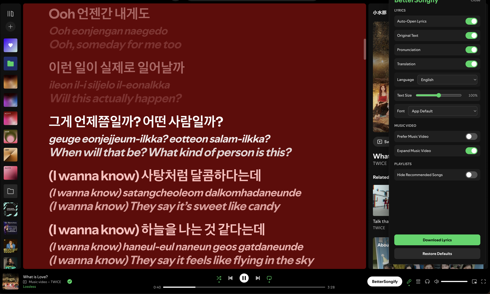

# BetterSongify

[](https://ko-fi.com/orangechuice)

A set of quality-of-life improvements for Spotify's UI: lyric translation and transliteration, sticky music-video preferences, lyrics display controls, and playlist cleanups. It ships in two forms: a script injected into the Spotify desktop app, and a Chrome extension for the web player at `open.spotify.com`.

## Features

- **Translated lyrics** — adds translated text below each lyric line using Google Translate.
- **Transliteration / romanization** — shows romanized readings when available (e.g. for Japanese, Korean, Chinese).
- **Dual-language display** — toggle between original-only, translated-only, or side-by-side views.
- **Lyrics style** — text size and font controls for the lyrics view.
- **Auto-open lyrics** — opens the lyrics view once per track change.
- **Sticky music video** — makes "switch to video" genuinely persist across track changes, and optionally re-expands the Now Playing view when a video plays.
- **Hide Recommended Songs** — removes the "Recommended" section from your own playlists.
- **Settings panel** — all of the above via a side panel inside Spotify.
- **Download lyrics** — save the currently displayed lyrics combination (original, pronunciation, translation) as a plain-text file.



## Getting Started

### Prerequisites

- **Node.js** (any recent LTS version).
- For the desktop target: **macOS** with the Spotify desktop app installed.
- For the web target: **Google Chrome** (or any Chromium browser that loads unpacked extensions).

### Quick Start & Installation

#### Option A: Spotify Desktop App (macOS)

Run the local installer script directly:

```sh
npm run install:macos
```

Additional installer commands:

```sh
npm run reinstall:macos # Clean remove existing injection, then build and inject fresh
npm run remove:macos    # Remove the injection and restore stock Spotify
```

> **Note:** Spotify application updates will overwrite modified interface files. Simply re-run `npm run install:macos` after Spotify updates.

#### Option B: Web Player (Chrome Extension)

1. Build the extension bundle:
   ```sh
   npm run build
   ```
2. Open `chrome://extensions` in Google Chrome.
3. Enable **Developer mode** (toggle in top-right corner).
4. Click **Load unpacked** and select the `dist/chrome/` directory in this repository.
5. Open or refresh `open.spotify.com`.

### Building from Source

```sh
npm run build        # Build both targets: dist/BetterSongify.js and dist/chrome/
npm run check        # Syntax-check sources, rebuild, then syntax-check outputs
```

## Support

If you enjoy BetterSongify and find it helpful, consider supporting development on [Ko-fi](https://ko-fi.com/orangechuice)!

[](https://ko-fi.com/orangechuice)

## Disclaimer

- This project is **not affiliated with, endorsed by, or supported by Spotify or Google**. "Spotify" is a trademark of Spotify AB; it is used here only to describe what the project does.
- The desktop install works by modifying local Spotify application files on your machine. Doing so may violate Spotify's Terms of Use. **Use at your own risk** — you are responsible for ensuring you are permitted to inspect and modify those files in your environment.
- Translations use an unofficial, undocumented Google Translate endpoint. Its use is not sanctioned by Google, and it may be rate-limited, blocked, or changed without notice.
- The software is provided as-is, without warranty of any kind. See [LICENSE](LICENSE).

## License

[MIT](LICENSE)
